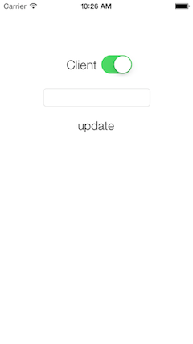

# OWUProximityManager

A simple interface to abstract away the `CLLocationManagerDelegate`, `CBPeripheralManagerDelegate`, `CBCentralManagerDelegate` and `CBPeripheralDelegate` spaghetti.

Suggestions, issues and pull requests are more than welcome.

## Sample Project

To simulate entering a defined region, select Client on one device, **then** select Server on the other. As the devices will likely be next to eachother when the exchange takes place, it's likely that the Client device will fire off a couple of it's delegate methods followed by the `proximityServerDidConnectToClient` delegate call on the Server device.

  

A few small caveats:
- Two iOS 7 devices are required
- `locationManager:DidEnterRegion:` and therefor `proximityClientDidEnterBeaconRegion` will not be called if the Client starts while already in range of the Server
- `locationManager:DidExitRegion:` and the resulting `proximityClientDidExitBeaconRegion` will not be called until about a minute after exiting the region ([dev forum link](https://devforums.apple.com/message/898335#898335))

## Usage

First, create three UUID's using something like `uuidgen` for `OWUProximityManagerConstants.h`

Then, `#import "OWUProximityManager.h"`

OWUProximityManager can be configured as a Client or Server. To get things started as either, just call `[[OWUProximityManager shared] startupClientWithDelegate:delegate]` or `[[OWUProximityManager shared] startupServerWithDelegate:delegate]` and implement either or both of `OWUProximityClientDelegate` and `OWUProximityServerDelegate` to be notified of proximity events.

By default, the connection between the Client and Server will happen at `CLProximityNear` so it is possible if your devices are on opposite sides of the desk that you will need to move them closer. Pay attention to the console to see the distance at which the Client is currently ranging.

## ToDo's
- More fine tuning of BeaconRegion measured power
- Handle invalidated services in `OWUProximityServer`
- Properly handle return from local notification
- And moar.

## License
OWUProximityManager is available under the MIT license. See the LICENSE file for more info.
